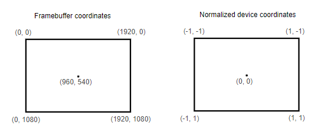

# vulkanBasics
Learning Vulkan API


## Prerequisites
* [CMake](https://cmake.org/download/)
* [Vulkan SDK](https://vulkan.lunarg.com/sdk/home) ([Installation guide](https://vulkan.lunarg.com/doc/sdk/latest/windows/getting_started.html))


## Build and Run
```
cmake -B build -S .
cmake --build build
```
* Then navigate to the output file (.exe) and run it.

OR (in VSCode)

* Start debugging (Press F5) (Currently configured for Clang with Ninja and MSVC for Windows)

OR (using bat scripts from `scripts` folder)

* Run them from the root directory of the repo. For example:
```
./scripts/config-msvc.bat
./scripts/build-msvc-rel.bat
./scripts/run-msvc-rel.bat
```


## Notes
### General overview
* Create an instance of the Vulkan API (`VkInstance`)
* Query for Vulkan supported hardware `VkPhysicalDevice`
* Create a logical device `VkDevice` to specify which features you want to use (`VkPhysicalDeviceFeatures`)
* Vulkan commands are executed asynchronously by submitting them to `VkQueue`
* There are different queue families, each of which supports a specific set of operations
* We need two more components to render window surface - `VkSurfaceKHR` and `VkSwapchainKHR`
* Drawing an image requires `VkImageView` and `VkFramebuffer`
* Render pass determines how the contents of the image should be treated
* Before Vulkan operations are submitted to the queue, they need to be recorded to `VkCommandBuffer`
* The commands are allocated from a `VkCommandPool`

### Validation layers
* Similar to extensions, validation layers need to be enabled by specifying their name
* All of the useful Standard validation is bundled into `VK_LAYER_KHRONOS_validation`
* Validation layers log debug messages into standard output by default
	* This can be changed by providing explicit callback
* Message callbacks filters logs (you can configure to show certail logs)

### Physical device
* We need to select a physical device that supports the features we need
* Multiple physical devices can be selected and run simultaneously

### Queue families
* Every Vulkan operation requries commands to be submitted to a queue
* Each family of queues only allows a subset of commands

### Logical device and queues
* Specify which queues to create after querying queue families
* Currently available drivers will only allow to create a small number of queues for each queue family
	* You don't really need more than one
* We can create all of the command buffers on multiple threads and then submit them all at once on the main thread
* You can assign priorities to the queues
* Queues are automatically created with the logical device
	* Device queues are implicitly destroyed when the device is destroyed

### Window surface
* Vulkan cannot directly interface with the window system
	* We use WSI (Window System Integration) extensions
		* `VK_KHR_surface`
* Window surface is required to render images

### Presentation queue
* Queue families supporting drawing commands and the ones supporting presentation may not overlap
	* there should be a distinct presentation queue

### Swap chain
* Vulkan doesn't have a default framebuffer
* It is a queue of images waiting to be rendered on the screen
* All graphics cards cannot render images directly to the screen
	* So no such functionality in Vulkan core
	* We need to enable `VK_KHR_swapchain` device extension
* Simply checking swap chain availability is not enough, we need to check if it is supported by our window surface.
* We also need to check:
	* basic surface capabilities (min/max number of images in swap chain)
	* surface formats (pixel format and color space)
	* available presentation modes
* We need to find the right settings for swap chain, settings such as 
	* Surface format (color depth)
	* Presentation mode (conditions for "swapping" images to the screen)
	* Swap extent (resolution of images in swap chain)
	* (we will have an ideal value in mind for each of these)
* Presentation mode
	* Only `VK_PRESENT_MODE_FIFO_KHR` is guaranteed to be available
	* `VK_PRESENT_MODE_IMMEDIATE_KHR`: immediately display images from the front of the queue; v-sync: off
	* `VK_PRESENT_MODE_FIFO_KHR`: the swap chain acts like a queue (writes image from the front); v-sync: on
	* `VK_PRESENT_MODE_FIFO_RELAXED_KHR`: doesnt wait for the next vertical blank; if the application is late and the queue is empty
	* `VK_PRESENT_MODE_MAILBOX_KHR`: images in the queue are replaced with new ones
* Swap extent
	* match the resolution of the window and the swap chain images

### Image views
* To view an image; access the image and which part of the image to access


### Graphics Pipeline
* They are a sequence of operations that take the vertices and textures of your meshes all the way to the pixels in the render targets.
* vertex/index buffer > input assembler > vertex shader > tessellation > geometry shader > rasterization > fragment shader > color blending > framebuffer.
	* **input assembler:** collects raw vertex data from the buffers
	* **vertex shader:** run for every vertex and generally applies transfomrations to turn vertex positions from model space to screen space
	* **tessellation shaders:** allows you to subdivide geometry based on certain rules to increase the mesh quality
	* **geometry shader:** runs on every primitive (triangle, line, point) and can discard it or output more primitives. (not used much nowadays)
	* **rasterization:** discretizes the primitives into fragments; any fragment that fall outside the screen are discarded; the attributes outputted by the vertex shader are interpolated across the fragments
	* **fragment shader:** run for every fragment; determines which framebuffer the fragments are written to and with which color and depth values
	* **color blending:** mix different fragments that map to the same pixel in the framebuffer


### Shader modules
* shader code in vulkan has to be in bytecode
	* SPIR-V
	* this makes turning shader code to native code less complex
		* with GLSL, the implementation can vary between GPU vendors 
* **compiler:** `glslc.exe`
	* same parameter format as gcc and clang
* **Coordinate system**
	* notice that the Y coordinates are flipped; -1 to 1 from top to bottom
	
	
* you can also compile shaders from code; [libshaderc](https://github.com/google/shaderc)
* Shader modules are just a wrapper around the shader bytecode
* SPIR-V bytecode and machine code are linked after the graphics pipeline is created
* so we can destroy the shader modules after the pipeline creation is complete
* to create shaders, we need to assign them to a specific pipeline stage


### Fixed functions
* **Dynamic state:**
	* most of the pipeline states have to be baked into the pipeline state, there are some that can be changed without recreating the pipeline at draw time

* **Vertex Input:**
	* format of the vertex data
	* Bindings: spacing between data and whether the data is per-vertex of per-instance
	* Attribute descriptions: which binding to load attributes from, and at which offset

* **Input Assembly:**
	* describes what kind of geometry will be drawn from the vertices, and if primitive restart should be enabled

* **Viewports and scissors:**
	* any pixels outside the scissor rectangle will be discarded
	* they can both be specified as static state or dynamic state

* **Rasterizer:**
	* takes geometry shaped by vertices and turns them into fragments
	* performs depth testing, face culling, and scissor test

* **Multisampling:**
	* combine fragment shader results of multiple pixel into the same pixel
	* anti-aliasing
	* only runs the fragment shader once

* **Depth and stencil testing**

* **Color blending:**
	* combine the fragment shader color with the color already in the framebuffer
	* `VkPipelineColorBlendAttachmentState`: configuration per attached framebuffer
	* `VkPipelineColorBlendStateCreateInfo`: global color blending settings
	* blending operation is performed in the following way:
	```
	if (blendEnable) {
		finalColor.rgb = (srcColorBlendFactor * newColor.rgb) <colorBlendOp> (dstColorBlendFactor * oldColor.rgb);
		finalColor.a = (srcAlphaBlendFactor * newColor.a) <alphaBlendOp> (dstAlphaBlendFactor * oldColor.a);
	} else {
		finalColor = newColor;
	}

	finalColor = finalColor & colorWriteMask;
	```

* **Pipeline layout:**
	* specify the uniform values (values passed to the shaders)


### Render pass
* specify framebuffers that will be used while rendering
	* specify color, depth buffers, samples
* before finishing pipeline creation
* **Subpasses and attachment references**
	* a single render pass can consist of multiple render passes
	* the subpasses depend on the contents of the framebuffers in the previous passes


### Framebuffers
* binds the attachments created during render pass
	* references all of the image views (attachments)
* we have to create framebuffer for all images in the swapchain
* framebuffers can only be used with render pass that it is compatible with


### Command buffers
* commands (drawing, memory transfer) in vulkan are not executed directly using function calls, instead, the commands have to be recorded in command buffers
	* vulkan can more efficiently process the commands since all of them are available together
* **Command Pools:**
	* needs to be created before creating command buffers 
	* manage memory that is used 
	* command pools can only allocate command buffers that are submitted by a single type of queue
* command buffers are executed by submitting them on one of the device queues
* command buffers are automatically freed when their command pool is destroyed


## References
* [Vulkan tutorial](https://vulkan-tutorial.com/)


## Dev Screenshots
* Initial console window showing available Vulkan extensions and physical device

	