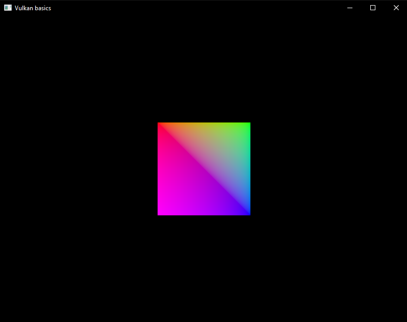
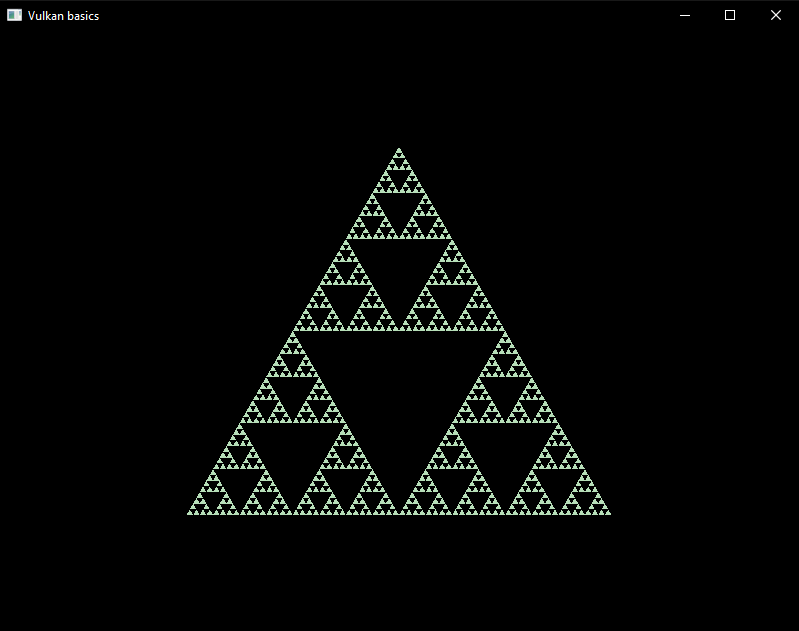

# vulkanBasics
Learning Vulkan API


## Prerequisites
* [CMake](https://cmake.org/download/)
* [Vulkan SDK](https://vulkan.lunarg.com/sdk/home) ([Installation guide](https://vulkan.lunarg.com/doc/sdk/latest/windows/getting_started.html))


## Build and Run
```
cmake -B build -S .
cmake --build build
```
* Then navigate to the output file (.exe) and run it.

OR (in VSCode)

* Start debugging (Press F5) (Currently configured for Clang with Ninja and MSVC for Windows)

OR (using bat scripts from `scripts` folder)

* Run them from the root directory of the repo. For example:
```
./scripts/config-msvc.bat
./scripts/build-msvc-rel.bat
./scripts/run-msvc-rel.bat
```


## Usage
* WASD to move the camera forward, left, back, and right respectively.
* E and Q to move the camera up and down.
* R to reset the camera
* Esc to close the window
* Left click and drag the mouse to move the view of the camera (in first person)


## Notes
(see [notes.md](./notes.md))


## References
* [Vulkan tutorial](https://vulkan-tutorial.com/)


## Dev Screenshots
* Initial console window showing available Vulkan extensions and physical device

	

* Hello Triangle

	

* Rectangle

	

* Sierpinski's triangle (checkout `sierpinski` branch)

	

* Depth buffer

	