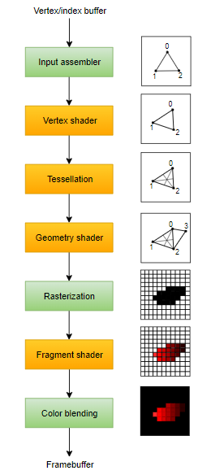
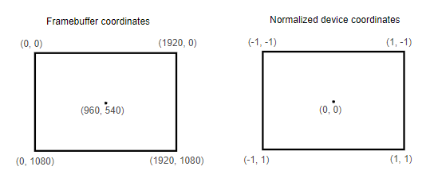

# Vulkan Basics Notes

## General overview
* Create an instance of the Vulkan API (`VkInstance`)
* Query for Vulkan supported hardware `VkPhysicalDevice`
* Create a logical device `VkDevice` to specify which features you want to use (`VkPhysicalDeviceFeatures`)
* Vulkan commands are executed asynchronously by submitting them to `VkQueue`
* There are different queue families, each of which supports a specific set of operations
* We need two more components to render - `VkSurfaceKHR` and `VkSwapchainKHR`
* Drawing an image requires `VkImageView` and `VkFramebuffer`
* Render pass determines how the contents of the image should be treated
* Before Vulkan operations are submitted to the queue, they need to be recorded to `VkCommandBuffer`
* The commands are allocated from a `VkCommandPool`

## Validation layers
* Similar to extensions, validation layers need to be enabled by specifying their name
* All of the useful Standard validation is bundled into `VK_LAYER_KHRONOS_validation`
* Validation layers log debug messages into standard output by default
	* This can be changed by providing explicit callback
	* This can be achieved by using Debug messengers
		* The application can describe what type of debug messages and the severity of the messages
		* A callback function can also be described that gets triggered when a message with the appropriate severity and type is encountered.
* Message callbacks filters logs (you can configure to show certain logs)

## Physical device
* We need to select a physical device that supports the features we need
* Multiple physical devices can be selected and run simultaneously

## Queue families
* Every Vulkan operation requries commands to be submitted to a queue
* Each family of queues only allows a subset of commands

## Logical device and queues
* Vulkan exposes the device to the application
* logical devices are representations of the actual device in the application view
* Specify which queues to create after querying queue families
* Currently available drivers will only allow to create a small number of queues for each queue family
	* You don't really need more than one
* We can create all of the command buffers on multiple threads and then submit them all at once on the main thread
* You can assign priorities to the queues which influence command scheduling
* Queues are automatically created with the logical device
	* Device queues are implicitly destroyed when the device is destroyed

## Window surface
* Vulkan cannot directly interface with the window system
	* We use WSI (Window System Integration) extensions
		* `VK_KHR_surface`
* Window surface is required to render images

## Presentation queue
* Queue families supporting drawing commands and the ones supporting presentation may not overlap
	* there should be a distinct presentation queue

## Swap chain
* Vulkan doesn't have a default framebuffer
* Swapchain is a queue of images waiting to be rendered on the screen
* Swapchain is used to synchronize the presentation of images in with the refresh rate of the screen
* All graphics cards cannot render images directly to the screen
	* So no such functionality in Vulkan core
	* We need to enable `VK_KHR_swapchain` device extension
* Simply checking swap chain availability is not enough, we need to check if it is supported by our window surface.
* We also need to check:
	* basic surface capabilities (min/max number of images in swap chain)
	* surface formats (pixel format and color space)
	* available presentation modes
* We need to find the right settings for swap chain, settings such as
	* Surface format (color depth)
	* Presentation mode (conditions for "swapping" images to the screen)
	* Swap extent (resolution of images in swap chain)
	* (we will have an ideal value in mind for each of these)
* Presentation mode
	* Only `VK_PRESENT_MODE_FIFO_KHR` is guaranteed to be available
	* `VK_PRESENT_MODE_IMMEDIATE_KHR`: immediately display images from the front of the queue; v-sync: off
	* `VK_PRESENT_MODE_FIFO_KHR`: the swap chain acts like a queue (writes image from the front); v-sync: on
	* `VK_PRESENT_MODE_FIFO_RELAXED_KHR`: doesnt wait for the next vertical blank; if the application is late and the queue is empty
	* `VK_PRESENT_MODE_MAILBOX_KHR`: images in the queue are replaced with new ones
* Swap extent
	* match the resolution of the window and the swap chain images

## Image views
* Image views have to be created to use any images (including the one in the swap chain)
* To view an image; access the image and which part of the image to access


## Graphics Pipeline
* They are a sequence of operations that take the vertices and textures of your meshes all the way to the pixels in the render targets.
	
* **input assembler:** collects raw vertex data from the buffers
* **vertex shader:** run for every vertex and generally applies transfomrations to turn vertex positions from model space to screen space
* **tessellation shaders:** allows you to subdivide geometry based on certain rules to increase the mesh quality
* **geometry shader:** runs on every primitive (triangle, line, point) and can discard it or output more primitives. (not used much nowadays)
* **rasterization:** discretizes the primitives into fragments (pixels to that are filled on the framebuffer); any fragment that fall outside the screen are discarded; the attributes outputted by the vertex shader are interpolated across the fragments
* **fragment shader:** run for every fragment; determines which framebuffer the fragments are written to and with which color and depth values
* **color blending:** mix different fragments that map to the same pixel in the framebuffer


## Shader modules
* shader code in vulkan has to be in bytecode
	* SPIR-V
	* this makes turning shader code to native code less complex
		* with GLSL, the implementation can vary between GPU vendors
* **compiler:** `glslc.exe`
	* same parameter format as gcc and clang
* **Coordinate system**
	* notice that the Y coordinates are flipped; -1 to 1 from top to bottom

	
* you can also compile shaders from code; [libshaderc](https://github.com/google/shaderc)
* Shader modules are just a wrapper around the shader bytecode
* SPIR-V bytecode and machine code are linked after the graphics pipeline is created
* so we can destroy the shader modules after the pipeline creation is complete
* to create shaders, we need to assign them to a specific pipeline stage


## Fixed functions
* Older graphics APIs provided default states for most of the pipeline stages. But in vulkan you have to be explicit about it
* **Dynamic state:**
	* most of the pipeline states have to be baked into the pipeline state, there are some that can be changed without recreating the pipeline at draw time (size of viewport, line width, blend constants)
	* those states are called dynamic states
	* this causes the configuration of those states to be ignored and we can specify the data at draw time

* **Vertex Input:**
	* format of the vertex data
	* Bindings: spacing between data and whether the data is per-vertex of per-instance
	* Attribute descriptions: which binding to load attributes from, and at which offset

* **Input Assembly:**
	* describes what kind of geometry will be drawn from the vertices, and if primitive restart should be enabled

* **Viewports and scissors:**
	* any pixels outside the scissor rectangle will be discarded
	* they can both be specified as static state or dynamic state

* **Rasterizer:**
	* takes geometry shaped by vertices and turns them into fragments
	* performs depth testing, face culling, and scissor test

* **Multisampling:**
	* combine fragment shader results of multiple pixel into the same pixel
	* anti-aliasing
	* only runs the fragment shader once

* **Depth and stencil testing**

* **Color blending:**
	* combine the fragment shader color with the color already in the framebuffer
	* `VkPipelineColorBlendAttachmentState`: configuration per attached framebuffer
	* `VkPipelineColorBlendStateCreateInfo`: global color blending settings
	* blending operation is performed in the following way:
	```
	if (blendEnable) {
		finalColor.rgb = (srcColorBlendFactor * newColor.rgb) <colorBlendOp> (dstColorBlendFactor * oldColor.rgb);
		finalColor.a = (srcAlphaBlendFactor * newColor.a) <alphaBlendOp> (dstAlphaBlendFactor * oldColor.a);
	} else {
		finalColor = newColor;
	}

	finalColor = finalColor & colorWriteMask;
	```

* **Pipeline layout:**
	* specify the uniform values (values passed to the shaders)


## Render pass
* Render passes contain information about
	* framebuffer attachments that will be used during rendering
	* no. of color and depth buffers, no. of samples for each of them, and how they should be handled
* **Subpasses and attachment references**
	* a single render pass can consist of multiple render passes
	* subpasses are subsequent rendering operations and depend on the contents of the previous render passes
	* vulkan can reorder the rendering operations and conserve memory bandwidth, if we group the rendering operations into one render pass
	* the subpasses depend on the contents of the framebuffers in the previous passes


## Framebuffers
* binds the attachments created during render pass
	* references all of the image views (attachments)
* we have to create framebuffer for all images in the swapchain
* framebuffers can only be used with render pass that it is compatible with


## Command buffers
* commands (drawing, memory transfer) in vulkan are not executed directly using function calls, instead, the commands have to be recorded in command buffers
	* vulkan can more efficiently process the commands since all of them are available together
* **Command Pools:**
	* needs to be created before creating command buffers
	* manage memory that is used to store the buffers
	* command pools can only allocate command buffers that are submitted by a single type of queue
* command buffers are executed by submitting them on one of the device queues
* command buffers are automatically freed when their command pool is destroyed


## Rendering and Presentation
* **Rendering Steps:**
	* Wait for the previous frame to finish
	* Acquire an image from the swap chain
	* Record a command buffer (to draw the scene on to the image)
	* Submit the recorded command buffer
	* Present the swap chain image

* Synchronization of operations must be explicitly defined
* Vulkan API calls are asynchronous
* But there are some events that need to be in explicit order
	* like acquiring an image from the swap chain
* We can use semaphores or fences to order the calls
* with semaphores, waiting happens in the gpu, with fences, waiting happens in the cpu
* if the host (cpu) needs to know when the gpu has finished something, a fence is used
* we use semaphores for swapchain and use fences when waiting for previous frame to finish (so that we dont draw more than on frame at a time)

* Currently we have a single subpass, but there are 2 built-in subpasses that control the image layout transitions (at the start and at the end of the render pass).
* The first subpass occurs at the start of the pipeline, but we dont have the image at this point
* there are 2 ways to deal with this, wait on the `VK_PIPELINE_STAGE_TOP_OF_PIPE_BIT` stage, or `VK_PIPELINE_STAGE_COLOR_ATTACHMENT_OUTPUT_BIT`


## Frames in flight
* Currently, we wait for the previous frame to finish before we start rendering the next frame
	* keeps the host waiting unnecessarily
* We want to allow multiple frames to be *in-flight* at once
	* rendering of one frame to not interfere with recording of the other
* all the resources that is accessed and modified during rendering must be duplicated
* we need multiple command buffers, semaphores and fences
	* each frame should have its own command buffer, set of semaphores, and fences.


## Swapchain recreation
* if the window size changes, swapchain is no longer compatible with the window surface
* we need to catch these events and recreate the swapchain
* Vulkan can notify us when the swapchain is no longer adequete during presentation (`vkAcquireNextImageKHR` and `vkQueuePresentKHR`)
	* **Out-of-date swapchain:** swapchain incompatible with the surface and cannot be used for rendering
	* **Suboptimal swapchain** swapchain can still be used to present to the surface but the surface properties are no longer matched


## Vertex Binding
### Binding descriptions
* how to pass the data to vertex shader
* describe at what rate to input the vertex data
	* `VK_VERTEX_INPUT_RATE_VERTEX`: Move to the next data entry after each vertex
	* `VK_VERTEX_INPUT_RATE_INSTANCE`: Move to the next data entry after each instance

### Attribute descriptions
* how to extract a vertex attribute from a chunk of vertex data


## Vertex Buffer creation
* we have to manage memory for the buffer


## Staging buffer
* we create two buffers, a staging buffer (in the CPU), and a vertex buffer (in the device's local memory)
	* requires transfer queue
	* transfer operations are also executed using command buffers


## Uniform buffers
* we can use vertex buffers for example, to store MVP matrices, but we would have to update the vertex buffers whenever the transformations change
* so we use *resource descriptors*, they are a way for the shaders to freely access resources like buffers and images and *descriptor sets* specify the actual buffers and images that will be bound to the descriptors.
* steps:
	* specify a descriptor layout during pipeline creation
	* allocate a descriptor set from a descriptor pool
	* blind the descriptor set during rendering
* descriptor sets need to be allocated from a pool like command buffers (descriptor pool)


## Texture mapping
### Image
* Steps
	* create an image object backed by device memory
	* fill it with pixels from an image file
	* create an image sampler
	* add a combined image sampler descriptor to sample colors from the texture
* swap chain also uses image objects but those were automatically created by it
* creating an image and filling it up with data is similar to vertex buffers
	* but images can have different layouts that affect how the pixels are organized in the memory
* we create a staging resource and fill it up with data, then copy it to the image object
	* we can create staging images but use `VkBuffer`
		* which is typically faster for some hardware
* pipeline barriers are used to synchronizing access to resources
	* to make sure the image has been written to before it is read
* Image objects use 2D coordinates to retrieve colors
* **Layout Transitions:**
	* to copy the buffer into the image, we need the image to be in the right layout first
	* one way to perform layout transitions is to use image memory barrier
		* they are used to synchronize access to resources (assures write to buffers completes before read)
		* also used to transition image layouts and transfer queue family ownership when `VK_SHARING_MODE_EXCLUSIVE` is used

### Image view and sampler
* **Texture Image view:**
	* Similar to swapchain, images are accessed through image views
* **Sampler:**
	* Shaders read texels from samplers.
	* they can apply filters and transformations.

### Combined Image Sampler
* Combined image sampler is a new type of descriptor.
* It makes it possible for the shaders to image resources through a sampler.


## Depth buffering
* depth buffer is an attachment that stores depth for each position.
* Vulkan depth range = 0 to 1
	* OpenGl depth range = -1 to 1
	* so we use `GLM_FORCE_DEPTH_ZERO_TO_ONE`
* similar to the color attachment, depth attachment is also based on image. But for depth attachment, the swapchain will not automatically create depth images.
* because only one draw operation is running at once, we only need one depth image.
* a subpass can only use a single depth + stencil buffer